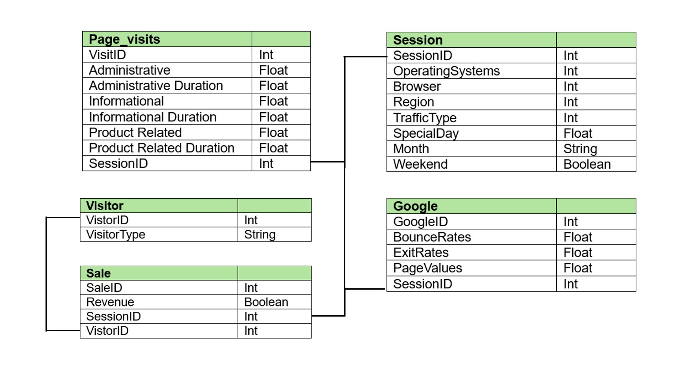
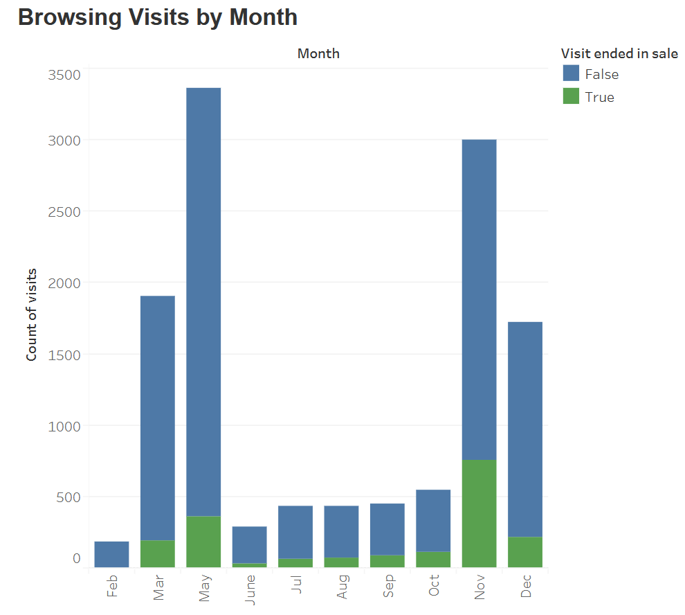
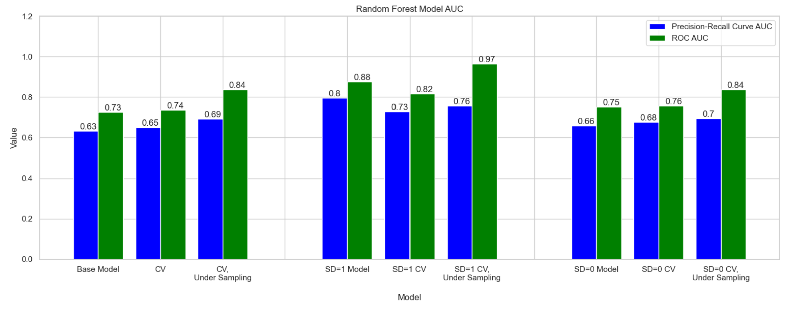

# Predicting Online Shoppers' Intentions

## Background
Bookstore X is an ecommerce bookstore selling books directly to consumers. The company tracks marketing and sales data, as well as customer purchase and browsing data. This project leverages customer browsing data to find key insights to improve sale conversion rates.
The analysis yielded findings and recommendations in the following areas:
-	**Sales predictions:** Determination if browsing and temporal data is predictive of book sales.
-	**Feature analysis:** Evaluation of which factors are most correlated with a sale.
-	**Temporal comparison:** An assessment of the impact of holidays on sales.

## Dataset
Bookstore X’s data was sourced from the [UCI Machine Learning Repository]( https://archive.ics.uci.edu/dataset/468/online+shoppers+purchasing+intention+dataset).
The consumer behavior dataset, authored by Sakar et al (2018), comprises 12.3K sessions, each representing a visitor to an online store. To ensure a broad representation, each session encapsulates a person over a one-year period, mitigating biases tied to specific campaigns, special days, user profiles, or periods (UCI). No data is available for the months of January and April.
The proposed database structure can be seen below:

## Executive Summary
### Sales Trends
-	The company’s sales peaked in November, with 760 sales for a conversion rate of 25%. This corresponds with increases in consumer spending throughout the economy during the holiday season.
-	Sales rose slightly from the start of the year until May. Total sales then were much small, yet slightly increasing for 4 months and then jumping up in November. 
-	From October to November, sales jumped 661% because of a large increase in users. The conversion rate rose 4%. 
-	Conversion rates jump from 2% to 10% for February to March. The conversion rates then exhibit an upward trend month-over-month before dropping off in December to 13%.

### Modeling Insights
-	The most important feature (based on Gini) in predicting a sale was PageValues, which is the average value for a page that a user visited before landing on the goal page or completing a transaction (or both).
-	The strongest performing models utilized under sampling of the target variable, which had higher AUC metrics.
-	Taking subsets of the data by the variable SpecialDay showed improved model performance across the key performance metrics for class 1 (a sale).

### Recommendations
-	More than one model should be implemented depending on the time frame of sales prediction (shopping near or on a special day/holiday versus not shopping at that time). 
-	Additional sales data should be collected for further analysis and to better optimize the modeling, including total dollars per transaction and the number items per sale.
-	Future tests should investigate the effect of offering sales, either to all people or targeted by return customers, during holiday periods and other times of the year.

## Objectives

The main objective of this project is:

> **To predict Revenue, a binary target variable (True/False) signifying whether the visit culminated in a transaction.**

To achieve this objective, it was further broken down into the following 4 technical sub-objectives:

1. To perform in-depth exploratory data analysis to uncover trends
2. To engineer new predictive features
3. To develop a supervised model to predict sales
4. To investigate the relationship between temporal variables (e.g. SpecialDay) and the Google analytics variables

## Visualization Insights

- The target variable, Revenue, is imbalanced.
- All the numeric features are right skewed.
- SpecialDay is a categorical variable with numbers, not a continuous variable.

## Engineering Features
Feature selection and binning techniques were utilized.

Using a decision tree model, the features were ranked based on Gini score. Correlation analysis revealed highly correlated variables. For each highly correlated pair, the variable with the lower Gini was removed. Further checks to the VIF scores revealed minimal multicollinearity, meaning that the new set of variables were prepared for predictive modeling. The final features were PageValues, Administrative_Duration, ProductRelated_Duration, and BounceRates.

## Model Selection and Results

Three sets of models were created. The key performance metrics to compare the models were ROC AUC and PR curves because the target variable was binary and imbalanced. First all the data was used to create three models: a random forest model (base model), a random forest model with k=5 folds cross validation, and a random forest model with cross validation and under-sampling of the target variable. Next, the data was split by the binary value of the SpecialDay variable. For each data subset, SD=1 and SD=0, three random forest models with the same procedures as with the full dataset were built.

The models with the largest ROC AUC values utilized under sampling of the target variable and cross validation. Sub-setting the observations by the SpecialDay variable, using the same features determined in feature selection, showed promising results. One caveat was that this the subset was small (test set n=251).  The set of models built from the data where SD=1 had higher PR AUC values than the other sets of models. The test set accuracy improved by approximately 10% the models built on the subset of data, SD=1, compared with the models built without the subset.

## Find the full code here:

* [Online Shopping Prediction - Github](https://github.com/griffin-reichmuth/Portfolio-Online-Shopping)
