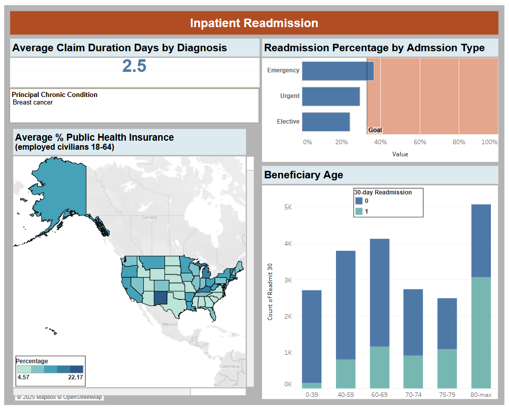
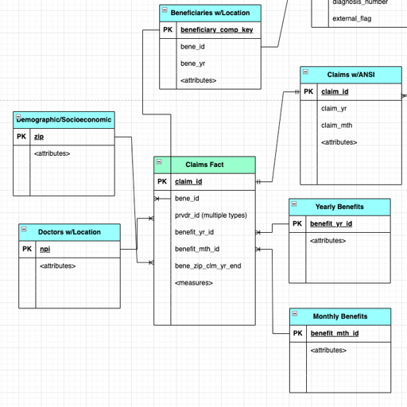
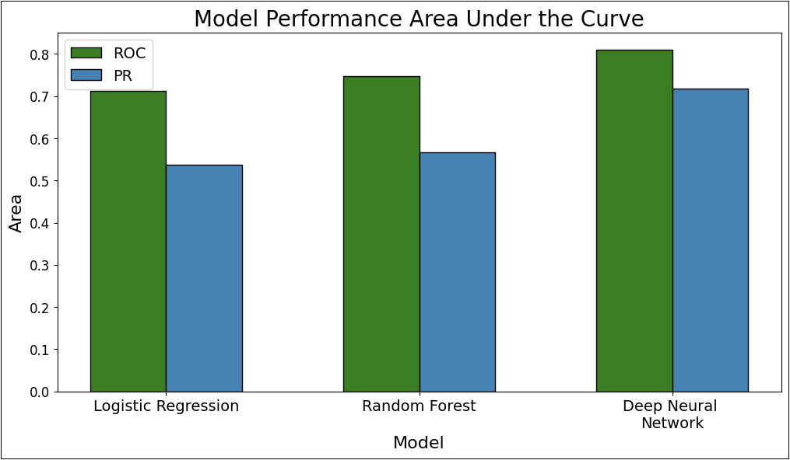

# Healthcare Readmission Forecasting
As a part of my capstone project for my MS at DePaul, I worked on a team to analyze Medicare claims records to uncover key insights by developing predictive models. My analyses investigated inpatient reamission for beneficiaries.

## Claims and Readmission Dashboard

<a href="https://public.tableau.com/views/InpatientReadmission/Dashboard2?:language=en-US&publish=yes&:sid=&:redirect=auth&:display_count=n&:origin=viz_share_link"> Dashboard link</a>

## Key Findings
### Readmission Trends
-	Beneficiaries with principal diagnoses of chronic have on average claims ranging from hours to 10 days.
-	Readmission rates vary by admission type, with more than 1 in 3 emergency inpatient admissions being readmissions.
-	Census data reveals that public health insurance coverage, an important predictor in readmission, varies by state. This indicates where targeted interventions for readmission may lead to cost savings.
-	The 80+ age group has a disproportionate amount of readmissions when compared to other age groups. 

### Modeling Insights
-	The neural networks models had the best performance out of the series of models tested with respect to all metrics but F1-Score.
-	Chronic conditions were key indicators of readmission, notably chronic kidney disease, ischemic heart disease, diabetes, and hyperlipidemia.
-	Beneficiary age of 80 was a key indicator of readmission.
-	Multiple variables related to civilian health insurance coverage for 18-64 year olds was the important which indicates that healthcare coverage in a given area plays an important role for all persons in predicting readmission. This was specifically for employed, unemployed, and not labor force workers.

### Recommendations
-	Healthcare professionals should consider condition chronic condition education and management as possible areas of cost prevention. 
-	Beneficiary age of 80 and over should be flagged as an important criterion in predicting readmission. 
-	Healthcare providers should consider working with local health agencies in supporting access to education for public and private healthcare insurance coverage options.

---

## Additional Details

## Background
The rising cost of Medicare in the United States is a significant challenge in keeping medical care available for senior citizens and sustainable for the companies that provide healthcare services. Medicare spending is projected to grow from 3.1% of gross domestic product (GDP) in 2021 to 4.3% by 2032, driven mostly by increased enrollment due to an aging population, rising healthcare costs, and increased use of services and intensity of care (Cubanski & Neuman, 2023). Policymakers and Medicare providers are faced with a significant challenge, requiring a deeper understanding of the factors driving the high expenditures. These analyses examine the relationship between current inpatient stays and future inpatient stays in order to predict and mitigate readmissions.

## Dataset
The main data comes from the Centers for Medicare and Medicaid Services (CMS). They provide synthetic, realistic-but-not-real, claims and beneficiary data for public research purposes. The data, representing beneficiary data from 2015-2023, contains enrollment information and healthcare claims for nearly 9,000 Medicare beneficiaries which comprise 1.1 million claims. Additional data includes ICD-10 diagnostic codes and zip code level data of socioeconomic indicators from the U.S. Census Bureau. 
Data was uploaded to a database in Google BigQuery by created by L. DeGrandchamp. 

The proposed database structure can be seen below:

## Model Comparison

## Find the full code here:

* [Healthcare Readmission Forecasting - Github](https://github.com/griffin-reichmuth/Healthcare_readmission_predication)

