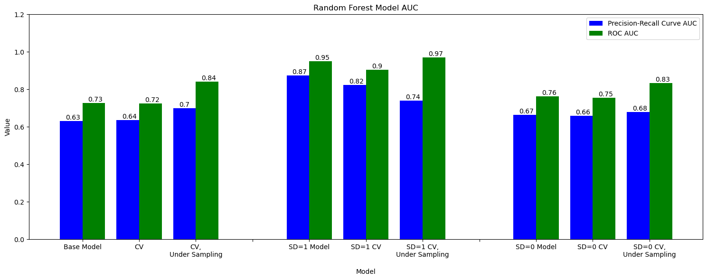

# Online Shoppers Intentions

## Dataset

The data for this project can be found on [UCI Machine Learning Repository](https://www.kaggle.com/datasets/tangodelta/api-access-behaviour-anomaly-dataset/data).

The consumer behavior dataset, authored by Sakar et al (2018), comprises 12.3K sessions, each representing a visitor to an online store. To ensure a broad representation, each session encapsulates a person over a one-year period, mitigating biases tied to specific campaigns, special days, user profiles, or periods (UCI).

## Objectives

The main objective of this project is:

> **To predict Revenue, a binary target variable (True/False) signifying whether the visit culminated in a transaction.**

To achieve this objective, it was further broken down into the following 4 technical sub-objectives:

1. To perform in-depth exploratory data analysis
2. To engineer new predictive features
3. To develop a supervised model to predict sales
4. To investigate the relationship between temporal variables (e.g. SpecialDay) and the Google analytics variables.

## Main Insights

From the exploratory data analysis, we found out that anomalous behavviour patterns are cahracterised by:

- The target variable, Revenue, is imbalanced.
- All the numeric features are right skewed.
- SpecialDay is a categorical variable with numbers, not a continuous variable.

## Engineered Features

Using a decision tree, the most important features ( based on Gini score) to be left in model were PageValues, Administrative_Duration, ProductRelated_Duration, and BounceRates.

As a result of this feature engineering work, the Precision-Recall AUC increased by 9% and the ROC AUC increased by 9%. This is in comparing the initial tree model used for feature selection and the random forest model built with under sampling and cross validation.

## Model Selection

Three sets of models were compared using ROC AUC and PR curve AUC because the target variable is binary and imbalanced.

The strongest performing models utilized under sampling of the target variable. This improved both AUC metrics. Subsetting the observations by the SpecialDay variable, using the same features determined in feature selection, shows promising results. Although the subset of data where SpecialDay=1 is small, analysis suggests that more than one model may be needed depending on the prediction timeframe (shopping near or on a special day/holiday versus not shopping at that time). More data may be needed to confirm this.

## Find the full code here:

* [Griffin Reichmuth](https://github.com/griffin-reichmuth/Portfolio-Online-Shopping)
